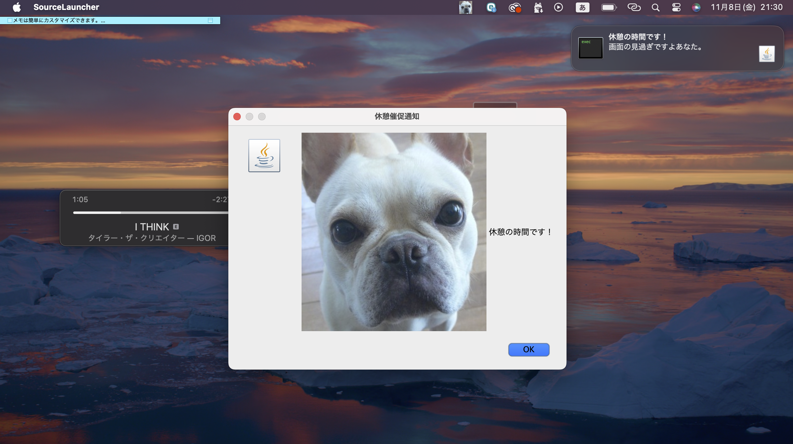

# 休憩催促通知

## ・背景
日常生活の中で仕事や家で長時間PCと睨めっこをしている人は多いだろう。長時間画面を見続けると目も疲れるし体もずっと固定されたままなので疲労が溜まり生活に支障が出てしまう。そこで私は長時間使用し続けると休憩の催促がくる機能を作成した。

## 実行画面ショット

## ・構成

このプロジェクトは2つのJavaファイルから構成される。

1. **sendNotification.java**: 通知を表示するためのクラス。
2. **timerPreference.java**: 指定された時間後に通知表示を発火するクラス。

## ・ファイル説明

### sendNotification.java

主な機能

- **notificationDisplay()**: 
  - システムトレイにアイコンを表示し、メッセージを通知。
  - メッセージには、休憩を促すテキストとアイコンを盛り込んだ。
  - アイコン画像は、プロジェクトのルートディレクトリにある `P1180131.jpg` 私の愛犬である。
  
- **displayImageNotification()**: 
  - 画像付きのポップアップ通知を表示。
  - ポップアップには、アイコンとメッセージが含まれる。

### timerPreference.java

このクラスは、指定された時間(タイマー)に通知を表示するためのタイマーを実装。

- **main()**:
  - 1時間(3600000秒)後に `sendNotification.notificationDisplay()` メソッドを呼び出す。
  
## ・使用方法

1. プロジェクトディレクトリに自分の好きな画像をセット。

#### 実行コマンド
   
   javac sendNotification.java timerPreference.java
